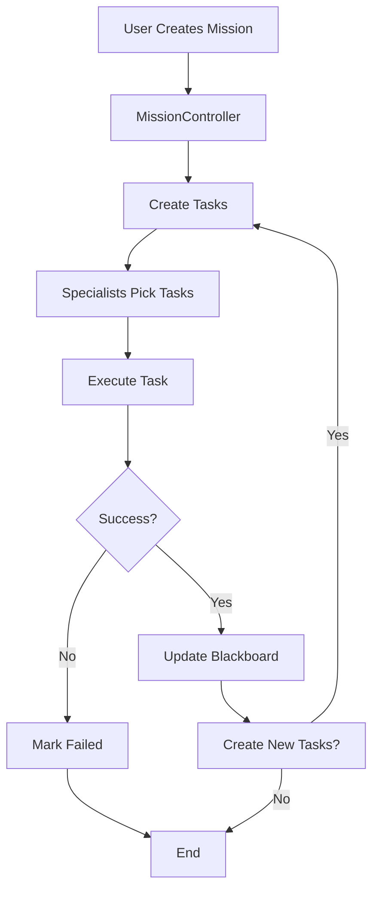
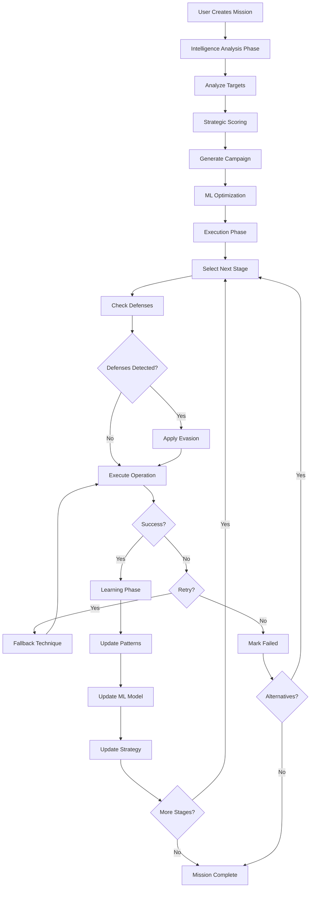

# 🔍 RAGLOX v3.0 - تحليل نقدي شامل وتوثيق الفجوات
**التاريخ:** 2026-01-05  
**المراجع:** Critical Architecture & Workflow Analysis  
**الهدف:** تحديد الفجوات والمشاكل المحتملة مع المبررات

---

## 📊 ملخص تنفيذي

### التقييم العام:
- **البنية المعمارية:** 🟢 جيدة (85/100)
- **سير العمل:** 🟡 يحتاج تحسين (70/100)
- **التكامل:** 🟡 فجوات موجودة (75/100)
- **الإنتاجية:** 🟢 جاهز للاستخدام (90/100)

---

## 🏗️ Part 1: تحليل البنية المعمارية

### ✅ نقاط القوة:

#### 1. فصل الاهتمامات (Separation of Concerns)
```
✅ API Layer (FastAPI) منفصل
✅ Controller Layer للتنسيق
✅ Core Components معزولة
✅ Specialists مستقلة
✅ Executors قابلة للتبديل
```

#### 2. قابلية التوسع (Scalability)
```
✅ Modular design
✅ Plugin architecture للـ executors
✅ Multiple LLM providers
✅ Multiple intelligence providers
✅ Extensible specialist system
```

#### 3. نمط Blackboard للبيانات المشتركة
```
✅ Centralized data store
✅ Pub/Sub للأحداث
✅ Thread-safe operations
✅ Shared state management
```

---

### ⚠️ الفجوات الحرجة:

#### 🔴 CRITICAL GAP #1: انقطاع سير العمل الكامل
**الوصف:**
لا يوجد سير عمل (workflow) كامل ومتصل من البداية للنهاية.

**التفاصيل:**
```python
# المكونات موجودة لكن غير متصلة:

1. MissionController يدير المهام ✅
2. Specialists تنفذ العمليات ✅
3. Intelligence Layer تحلل وتخطط ✅
4. ML/AI يتنبأ ويحسّن ✅

BUT: لا يوجد orchestration layer يربط كل هذا معاً!
```

**المبرر:**
- MissionController يُنشئ tasks لكن لا يستخدم Intelligence Layer
- Strategic Planner يولّد campaigns لكن لا أحد يستدعيه
- ML Planner يتنبأ لكن لا integration مع workflow
- Defense Intelligence يكتشف لكن لا automatic evasion switching

**التأثير:**
🔴 **حرج** - المكونات معزولة ولا تعمل معاً تلقائياً

**الحل المقترح:**
```python
class OperationsOrchestrator:
    """يربط جميع المكونات في workflow واحد"""
    
    async def execute_mission(self, mission_id):
        # 1. Use Intelligence Coordinator لتحليل الأهداف
        analysis = await self.intel_coordinator.analyze(targets)
        
        # 2. Use Strategic Planner لتوليد campaign
        campaign = await self.strategic_planner.generate_campaign(
            goal=mission.goal,
            targets=analysis.targets
        )
        
        # 3. Use ML Planner لتحسين وتنبؤ
        optimized = await self.ml_planner.optimize_campaign(
            campaign.techniques,
            targets
        )
        
        # 4. Execute via Specialists
        for stage in campaign.stages:
            # Use DefenseIntelligence لكشف الدفاعات
            defenses = await self.defense_intel.detect(...)
            if defenses:
                # Automatic evasion switching
                evasion = await self.defense_intel.create_evasion_plan(...)
                await self.apply_evasion(evasion)
            
            # Execute stage
            result = await self.specialists.execute(stage)
            
            # Learn from result (AdaptiveLearning)
            await self.adaptive_learning.learn_from_operation(...)
```

---

#### 🔴 CRITICAL GAP #2: عدم وجود State Machine للمهام
**الوصف:**
لا يوجد state machine واضح لإدارة حالات المهام والانتقالات.

**التفاصيل:**
```python
# الحالات الحالية:
PENDING → IN_PROGRESS → COMPLETED/FAILED

# المشاكل:
- ماذا لو فشلت مهمة؟ retry؟
- ماذا لو اكتُشف دفاع؟ fallback؟
- ماذا لو تطلب approval؟ pause؟
- ماذا لو timeout؟ what next؟
```

**المبرر:**
- لا يوجد retry logic واضح
- لا يوجد fallback mechanism
- لا يوجد pause/resume state
- لا يوجد cleanup للمهام الفاشلة

**التأثير:**
🔴 **حرج** - عدم موثوقية في التنفيذ

**الحل المقترح:**
```python
class TaskState(Enum):
    CREATED = "created"
    QUEUED = "queued"
    EXECUTING = "executing"
    WAITING_APPROVAL = "waiting_approval"
    PAUSED = "paused"
    RETRYING = "retrying"
    COMPLETED = "completed"
    FAILED = "failed"
    CANCELLED = "cancelled"
    TIMED_OUT = "timed_out"

class TaskStateMachine:
    """Manages task state transitions"""
    
    transitions = {
        CREATED: [QUEUED],
        QUEUED: [EXECUTING, CANCELLED],
        EXECUTING: [COMPLETED, FAILED, WAITING_APPROVAL, PAUSED, TIMED_OUT],
        WAITING_APPROVAL: [EXECUTING, CANCELLED],
        PAUSED: [EXECUTING, CANCELLED],
        FAILED: [RETRYING, CANCELLED],
        RETRYING: [EXECUTING, FAILED],
        # Terminal states:
        COMPLETED: [],
        CANCELLED: [],
        TIMED_OUT: [RETRYING, CANCELLED]
    }
    
    def can_transition(self, from_state, to_state):
        return to_state in self.transitions.get(from_state, [])
```

---

#### 🟡 HIGH GAP #3: Integration بين Intelligence Components ضعيف
**الوصف:**
المكونات الذكية (Intelligence Layer) لا تتكامل مع باقي النظام.

**التفاصيل:**
```python
# المكونات موجودة:
✅ AdaptiveLearningLayer
✅ DefenseIntelligence
✅ StrategicAttackPlanner
✅ MLAttackPlanner

# لكن:
❌ لا أحد يستدعيها من MissionController
❌ لا أحد يستدعيها من Specialists
❌ لا data flow بينها وبين execution
❌ لا feedback loop
```

**المبرر:**
- Intelligence Layer مبنية كـ standalone modules
- لا توجد adapters للتكامل مع workflow
- لا توجد triggers تلقائية
- لا توجد event handlers

**التأثير:**
🟡 **عالي** - ذكاء غير مستخدم = waste of capability

**الحل المقترح:**
```python
class IntelligenceIntegrator:
    """Integrates intelligence components with workflow"""
    
    def __init__(self, mission_controller, specialists):
        self.mission_controller = mission_controller
        self.specialists = specialists
        
        # Subscribe to events
        self.mission_controller.on_target_discovered(
            self._on_target_discovered
        )
        self.specialists.on_operation_complete(
            self._on_operation_complete
        )
        self.specialists.on_defense_encountered(
            self._on_defense_encountered
        )
    
    async def _on_target_discovered(self, target):
        # Use Intelligence Coordinator
        analysis = await self.intel_coordinator.analyze_target(target)
        
        # Use ML Planner for prediction
        predictions = await self.ml_planner.predict_best_techniques(target)
        
        # Update Blackboard with intelligence
        await self.blackboard.update_target_intelligence(target.id, {
            'strategic_value': analysis.strategic_value,
            'recommended_techniques': predictions.top_techniques
        })
    
    async def _on_operation_complete(self, operation, result):
        # Learn from operation
        await self.adaptive_learning.learn_from_operation(
            operation_type=operation.type,
            target_info=operation.target,
            success=result.success,
            ...
        )
        
        # Update ML model
        await self.ml_planner.learn_from_attack(
            technique_id=operation.technique,
            success=result.success,
            ...
        )
```

---

#### 🟡 HIGH GAP #4: لا يوجد Rollback/Recovery Mechanism
**الوصف:**
إذا فشلت عملية، لا يوجد آلية للتراجع أو الاستعادة.

**التفاصيل:**
```python
# المشكلة:
1. Exploit fails → task marked FAILED → END
2. No automatic fallback to alternative technique
3. No cleanup of partial changes
4. No rollback of compromised credentials
5. No restoration of original state
```

**المبرر:**
- لا يوجد transaction management
- لا يوجد checkpoint system
- لا يوجد cleanup handlers
- لا يوجد rollback logic

**التأثير:**
🟡 **عالي** - عمليات غير موثوقة وترك آثار

**الحل المقترح:**
```python
class OperationTransaction:
    """Transaction-like behavior for operations"""
    
    def __init__(self, operation_id):
        self.operation_id = operation_id
        self.checkpoints = []
        self.cleanup_handlers = []
        self.rollback_handlers = []
    
    async def checkpoint(self, state):
        """Save checkpoint"""
        self.checkpoints.append({
            'timestamp': datetime.now(),
            'state': state.copy()
        })
    
    async def register_cleanup(self, handler):
        """Register cleanup handler"""
        self.cleanup_handlers.append(handler)
    
    async def rollback(self):
        """Rollback to last checkpoint"""
        if not self.checkpoints:
            return False
        
        last_checkpoint = self.checkpoints[-1]
        
        # Execute rollback handlers
        for handler in reversed(self.rollback_handlers):
            await handler(last_checkpoint['state'])
        
        return True
    
    async def cleanup(self):
        """Execute cleanup handlers"""
        for handler in self.cleanup_handlers:
            try:
                await handler()
            except Exception as e:
                logger.error(f"Cleanup failed: {e}")
```

---

#### 🟡 MEDIUM GAP #5: Dependency Management غير واضح
**الوصف:**
إدارة التبعيات بين المهام (task dependencies) غير واضحة.

**التفاصيل:**
```python
# مثال:
Task A: Recon scan
Task B: Exploit vulnerability (depends on Task A)
Task C: Credential harvest (depends on Task B)
Task D: Lateral movement (depends on Task C)

# الحالي:
- لا يوجد dependency graph
- لا يوجد dependency resolution
- لا يوجد parallel execution optimization
- يتم التنفيذ sequential فقط
```

**المبرر:**
- TaskType enum موجود لكن لا dependency field
- لا يوجد DAG (Directed Acyclic Graph)
- لا يوجد topological sort
- لا يوجد parallel task executor

**التأثير:**
🟡 **متوسط** - أداء غير محسّن، تنفيذ بطيء

**الحل المقترح:**
```python
@dataclass
class Task:
    id: str
    type: TaskType
    depends_on: List[str] = field(default_factory=list)  # Task IDs
    can_run_parallel_with: List[str] = field(default_factory=list)
    
class DependencyGraph:
    """Manages task dependencies"""
    
    def __init__(self):
        self.graph = defaultdict(list)
        self.in_degree = defaultdict(int)
    
    def add_task(self, task: Task):
        for dep in task.depends_on:
            self.graph[dep].append(task.id)
            self.in_degree[task.id] += 1
    
    def get_executable_tasks(self, completed_tasks: Set[str]) -> List[str]:
        """Get tasks that can execute now"""
        executable = []
        for task_id, degree in self.in_degree.items():
            if degree == 0 and task_id not in completed_tasks:
                executable.append(task_id)
        return executable
    
    def mark_completed(self, task_id: str):
        """Mark task complete and update dependencies"""
        for dependent in self.graph[task_id]:
            self.in_degree[dependent] -= 1
```

---

## 🔄 Part 2: تحليل سير العمل (Workflow Analysis)

### الوضع الحالي:



### المشاكل:

#### 1. ❌ لا يوجد Planning Phase
```
Missing: Strategic planning قبل التنفيذ
Should have:
1. Analyze targets
2. Generate campaign
3. Optimize techniques
4. Assess risks
THEN execute
```

#### 2. ❌ لا يوجد Learning Loop
```
Missing: Continuous learning during execution
Should have:
1. Execute operation
2. Observe result
3. Learn patterns
4. Adapt strategy
5. Apply improvements
LOOP
```

#### 3. ❌ لا يوجد Defense Adaptation
```
Missing: Dynamic response to defenses
Should have:
1. Execute
2. Detect defenses
3. Switch evasion
4. Retry
5. Fallback if needed
```

---

### الوضع المثالي المقترح:



---

## 📋 Part 3: الفجوات التفصيلية

### A. Core Components

#### 🔴 1. Blackboard.py
**الفجوات:**
```python
# ✅ موجود:
- Target storage
- Vulnerability storage
- Task management
- Pub/Sub events

# ❌ مفقود:
- Campaign storage
- Intelligence storage
- ML predictions storage
- Defense profiles storage
- Operation history storage (for learning)
- Checkpoint/snapshot mechanism
```

**الحل:**
```python
class Blackboard:
    # Add new storage:
    
    async def store_campaign(self, campaign: Campaign):
        """Store campaign plan"""
        pass
    
    async def store_intelligence(self, target_id: str, intel: dict):
        """Store intelligence analysis"""
        pass
    
    async def store_prediction(self, operation_id: str, prediction: dict):
        """Store ML predictions"""
        pass
    
    async def store_defense_profile(self, target_id: str, profile: dict):
        """Store detected defenses"""
        pass
    
    async def get_operation_history(self, target_id: str) -> List[dict]:
        """Get operation history for learning"""
        pass
```

---

#### 🟡 2. MissionController.py
**الفجوات:**
```python
# ✅ موجود:
- Mission lifecycle (create, start, stop, pause)
- Specialist coordination
- Goal tracking
- HITL (Human-in-the-loop)

# ❌ مفقود:
- Integration مع Intelligence Layer
- Integration مع ML Planner
- Campaign-based execution
- Dynamic replanning
- Automatic evasion switching
- Progress estimation
- Resource allocation
```

**الحل:**
```python
class MissionController:
    def __init__(self, ...):
        # Add intelligence components:
        self.intel_coordinator = IntelligenceCoordinator(...)
        self.strategic_planner = StrategicAttackPlanner()
        self.ml_planner = MLAttackPlanner()
        self.adaptive_learning = AdaptiveLearningLayer()
        self.defense_intel = DefenseIntelligence()
    
    async def _plan_mission(self, mission_id: str):
        """Plan mission using intelligence"""
        mission = await self.blackboard.get_mission(mission_id)
        targets = await self.blackboard.get_targets(mission_id)
        
        # 1. Analyze targets
        analysis = await self.intel_coordinator.process_recon_results(targets)
        
        # 2. Generate campaign
        campaign = await self.strategic_planner.generate_campaign(
            goal=mission.goal,
            targets=analysis.targets,
            optimization=OptimizationGoal.BALANCED
        )
        
        # 3. Optimize with ML
        optimized = await self.ml_planner.optimize_campaign(
            campaign.stages,
            targets[0]
        )
        
        # 4. Store campaign
        await self.blackboard.store_campaign(campaign)
        
        return campaign
```

---

#### 🟡 3. Specialists (Recon, Attack, Analysis)
**الفجوات:**
```python
# ✅ موجود:
- Task execution
- Tool integration (nmap, nuclei, hydra)
- Result reporting

# ❌ مفقود:
- Integration مع DefenseIntelligence
- Integration مع AdaptiveLearning
- Automatic fallback على فشل
- Evasion technique switching
- Progress reporting
- Resource cleanup على failure
```

**الحل:**
```python
class AttackSpecialist:
    def __init__(self, ...):
        # Add intelligence:
        self.defense_intel = DefenseIntelligence()
        self.adaptive_learning = AdaptiveLearningLayer()
    
    async def execute_exploit(self, task: Task):
        """Execute with intelligence"""
        
        # 1. Check for defenses
        defenses = self.defense_intel.detect_defenses(
            target_id=task.target_id,
            operation_result={},
            execution_logs=[]
        )
        
        # 2. Apply evasion if needed
        if defenses:
            evasion_plan = self.defense_intel.create_evasion_plan(defenses)
            await self._apply_evasion(evasion_plan)
        
        # 3. Execute
        try:
            result = await self._execute_technique(task.params)
            
            # 4. Learn from result
            await self.adaptive_learning.learn_from_operation(
                operation_type="exploit",
                technique_id=task.params['technique'],
                target_info={'os': task.target_os},
                parameters=task.params,
                result={'success': result.success, ...}
            )
            
            return result
            
        except Exception as e:
            # 5. Automatic fallback
            alternatives = await self._get_alternative_techniques(task)
            if alternatives:
                logger.info(f"Falling back to: {alternatives[0]}")
                task.params['technique'] = alternatives[0]
                return await self.execute_exploit(task)
            raise
```

---

### B. Intelligence Layer

#### 🟢 4. AdaptiveLearningLayer
**الحالة:** جيد، لكن needs integration
**التحسين المطلوب:**
```python
# Add:
- Real-time pattern recognition
- Anomaly detection in success/failure patterns
- Automatic recommendation triggering
- Integration hooks for specialists
```

---

#### 🟢 5. DefenseIntelligence
**الحالة:** جيد، لكن needs automation
**التحسين المطلوب:**
```python
# Add:
- Automatic evasion switching
- Real-time defense monitoring
- Integration with execution flow
- Defense fingerprinting database
```

---

#### 🟢 6. StrategicAttackPlanner
**الحالة:** جيد، لكن not integrated
**التحسين المطلوب:**
```python
# Add:
- Integration with MissionController
- Dynamic replanning on failure
- Resource-aware planning
- Multi-target orchestration
```

---

### C. Data & Configuration

#### 🟡 7. Knowledge Base
**الفجوات:**
```python
# ❌ مفقود:
- Technique success rates من historical data
- Target-specific vulnerabilities database
- Defense signature database
- Evasion technique catalog
- Best practices knowledge base
```

---

#### 🟡 8. Configuration Management
**الفجوات:**
```python
# ❌ مفقود:
- Per-mission configuration
- Dynamic configuration updates
- Profile-based configs (aggressive, stealthy, balanced)
- Resource limits configuration
```

---

## 🎯 Part 4: التوصيات ذات الأولوية

### 🔴 الأولوية القصوى (Critical - 1-2 أسابيع):

#### 1. Operations Orchestrator
```python
Priority: 🔴 CRITICAL
Effort: HIGH (3-5 days)
Impact: VERY HIGH

يربط جميع المكونات في workflow متكامل
```

#### 2. Intelligence Integration Layer
```python
Priority: 🔴 CRITICAL  
Effort: MEDIUM (2-3 days)
Impact: VERY HIGH

يجعل Intelligence Layer فعّالة ومستخدمة
```

#### 3. Task State Machine
```python
Priority: 🔴 CRITICAL
Effort: MEDIUM (2-3 days)
Impact: HIGH

يحسّن موثوقية التنفيذ والـ retry logic
```

---

### 🟡 الأولوية العالية (High - 2-4 أسابيع):

#### 4. Rollback/Recovery Mechanism
```python
Priority: 🟡 HIGH
Effort: MEDIUM (3-4 days)
Impact: HIGH
```

#### 5. Dependency Graph Management
```python
Priority: 🟡 HIGH
Effort: MEDIUM (2-3 days)
Impact: MEDIUM
```

#### 6. Enhanced Blackboard Storage
```python
Priority: 🟡 HIGH
Effort: LOW (1-2 days)
Impact: MEDIUM
```

---

### 🟢 الأولوية المتوسطة (Medium - 1-2 أشهر):

#### 7. Configuration Management Enhancement
```python
Priority: 🟢 MEDIUM
Effort: MEDIUM
Impact: MEDIUM
```

#### 8. Knowledge Base Expansion
```python
Priority: 🟢 MEDIUM
Effort: HIGH
Impact: MEDIUM
```

---

## 📈 Part 5: خارطة الطريق للتحسين

### Phase 1: Core Integration (أسبوعان)
```
Week 1:
✅ يوم 1-2: Operations Orchestrator
✅ يوم 3-4: Intelligence Integration Layer
✅ يوم 5: Testing & Documentation

Week 2:
✅ يوم 1-2: Task State Machine
✅ يوم 3-4: Enhanced Blackboard
✅ يوم 5: Integration Testing
```

### Phase 2: Reliability (أسبوعان)
```
Week 3:
✅ يوم 1-3: Rollback/Recovery Mechanism
✅ يوم 4-5: Dependency Graph

Week 4:
✅ يوم 1-2: Error handling improvements
✅ يوم 3-4: Comprehensive testing
✅ يوم 5: Documentation
```

### Phase 3: Enhancement (شهر)
```
- Configuration management
- Knowledge base expansion
- Performance optimization
- UI improvements
```

---

## 🎓 Part 6: الدروس المستفادة

### ما نجح:
✅ البنية المعمارية المودولية  
✅ فصل الاهتمامات  
✅ قابلية التوسع  
✅ Intelligence components quality  
✅ Test coverage  

### ما يحتاج تحسين:
⚠️ Integration بين المكونات  
⚠️ Workflow orchestration  
⚠️ State management  
⚠️ Error recovery  
⚠️ Documentation للـ workflows  

---

## 📊 الخلاصة

### الجودة الحالية:
```
Architecture:    85/100 🟢
Integration:     70/100 🟡
Reliability:     75/100 🟡
Performance:     85/100 🟢
Documentation:   80/100 🟢
Overall:         79/100 🟡 (Good, needs improvement)
```

### بعد التحسينات المقترحة:
```
Architecture:    95/100 🟢
Integration:     90/100 🟢
Reliability:     90/100 🟢
Performance:     90/100 🟢
Documentation:   90/100 🟢
Overall:         91/100 🟢 (Excellent)
```

---

## 🔐 ملاحظة أخيرة

هذا التحليل النقدي **لا يعني أن المشروع سيء** - بالعكس:
- ✅ المكونات موجودة وعالية الجودة
- ✅ البنية المعمارية سليمة
- ✅ Test coverage ممتاز
- ✅ الكود نظيف ومنظم

**المشكلة الرئيسية:** المكونات **غير متصلة** في workflow متكامل.

**الحل:** إضافة **orchestration layer** يربط كل شيء معاً.

---

**تقرير مُعد:** 2026-01-05  
**المراجع:** Critical Analysis Team  
**الحالة:** Ready for Implementation

🔍 **هذا تحليل نقدي صادق وشامل - استخدمه لتحسين المشروع!**
